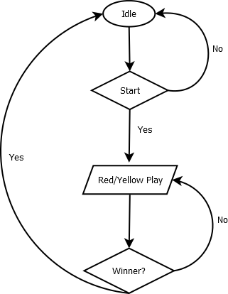

# TicTacToe
<h1> First Project in Six Month Challenge of Android App Development</h1>
<h2>I. Introduction</h2>

This project is just a basic tic tac toe game for starter project. The idea is having two player in the game, and these two players are represented by either red or yellow. This a 3x3 tic tac toe game

	
	
Figure 1. The screen of the game 

<h2>II. Procedure</h2>
<strong>Flow Chart</strong>

	
	
Figure 2. The flow chart of the game

These are steps needed for this project

<ol>
	<li>Download the <a href="https://developer.android.com/studio">android studio ide </a></li>
	<li>Download the source file. In this source file, the images are provided</li>
	<li>Open the file with ide</li>
	<li>Create a grid view for each square</li>
	<li>Drop one of the chip(Red/Yellow) into the square</li>
	<li>In the xml file, set up the tag for each chip so it is easier for developer to generate the source code</li>
	<li>Implement the source file in MainActivity.java. Each line of code is provided with comment of explaination</li>
</ol>
<h2>III. Result</h2>

The project finished successfully. The result is diplayed in figure 3,4, and 5. In this project, I have learnt about grid layout, tag number and action onclick in XML. Besides, the built in function such as findViewById(),setVisibility(),getChildCount(), and getChildAt() 

	
	
Figure 3. Gameplay of the TicTacToe

	

	
	
Figure 4. Red wins

	

	
	
Figure 5. Yellow wins

